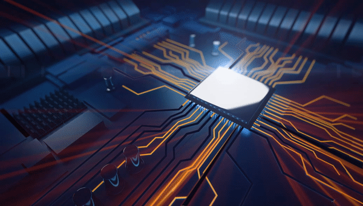

#   Investigacion

## ¿Qué es un computador?
Un computador es un dispositivo electrónico que puede procesar, almacenar y recuperar información de manera automática. Su función es ejecutar programas para realizar tareas de procesamiento de datos.

**Referencia:**
Stallings, W. (2018). *Computer Organization and Architecture: Designing for Performance* (10th ed.). Pearson Education.

## Arquitecturas de un computador
La arquitectura de un computador es cómo están organizados y conectados sus componentes internos, y cómo interactúan entre sí para procesar información.

### CISC (Complex Instruction Set Computing)
Es una arquitectura que usa un conjunto de instrucciones complejas para realizar tareas. Esto puede reducir el número de instrucciones, pero hacer que el procesador sea más lento y complejo.

**Ejemplo de equipos con CISC:**  
Procesadores Intel x86

### RISC (Reduced Instruction Set Computing)
Es una arquitectura que utiliza un conjunto de instrucciones más simple y rápido. Los procesadores RISC son más rápidos en operaciones simples, pero requieren más instrucciones para tareas complejas.

**Ejemplo de equipos con RISC:**  
Procesadores ARM (usados en muchos teléfonos móviles)

## ¿Qué es el hardware?
El hardware son todos los componentes físicos de un computador, como el procesador, memoria, discos y otros dispositivos.

### CPU (Unidad Central de Procesamiento)
Es el componente principal del computador que ejecuta las instrucciones de los programas. Se divide en:
- **ALU**: Realiza operaciones matemáticas y lógicas.
- **Unidad de Control**: Controla la ejecución de las instrucciones.
- **Registros**: Almacenan temporalmente los datos e instrucciones.
- **Buses**: Permiten el intercambio de datos entre componentes.

### GPU (Unidad de Procesamiento Gráfico)
Es un procesador especializado en gráficos y tareas paralelas, como la visualización de imágenes o videos.

**Diferencias entre CPU y GPU:**
- **CPU**: Menos núcleos, diseñada para tareas secuenciales.
- **GPU**: Más núcleos, ideal para tareas paralelas como el renderizado de gráficos.

### Memoria
- **Registros**: Pequeños almacenamientos dentro de la CPU.
- **Caché**: Memoria rápida que guarda datos de uso frecuente.
- **RAM**: Memoria volátil que almacena datos temporales.
- **Disco duro/SSD**: Almacena datos de forma permanente.

### Dispositivos de Entrada/Salida
Son los dispositivos que permiten la interacción con el computador, como el teclado (entrada) y el monitor (salida).

### Buses de Datos
Son canales que permiten el paso de datos entre los diferentes componentes del computador.

## ¿Qué es el software?
El software es el conjunto de programas que permiten a un computador realizar tareas. Es intangible y se divide en:

### Software de Sistema
Incluye programas como el sistema operativo, que gestionan los recursos del computador.

### Software de Aplicación
Son programas diseñados para tareas específicas, como procesadores de texto o navegadores web.

### Software de Desarrollo
Son herramientas usadas para crear otros programas, como los editores de código o los compiladores.

## Funcionamiento del Computador
### ¿Qué sucede cuando enciendes una computadora?
- Se realiza un **POST** (Power-On Self Test) para verificar el hardware.
- Se carga el sistema operativo.
- Se inician los servicios necesarios.

### ¿Qué pasa cuando ingresas un dato y ves el resultado?
1. El dato es recibido por el teclado y procesado por la CPU.
2. El resultado se almacena en la memoria RAM y se envía a la GPU.
3. La GPU muestra el resultado en la pantalla.

### ¿Cómo se codifican los datos internamente?
Los datos se representan en binario (0s y 1s), usando códigos como ASCII para texto.

### Unidades de medida de datos:
- **Bit**: Unidad básica (0 o 1).
- **Byte**: 8 bits, puede almacenar un carácter.
- **KB, MB, GB, TB**: Unidades mayores, cada una es 1024 veces la anterior.

**Referencias:**
- Stallings, W. (2018). *Computer Organization and Architecture: Designing for Performance* (10th ed.). Pearson Education.
- Tanenbaum, A. S., & Austin, T. (2013). *Structured Computer Organization* (6th ed.). Pearson Education.
- Hennessy, J. L., & Patterson, D. A. (2011). *Computer Architecture: A Quantitative Approach* (5th ed.). Elsevier.

