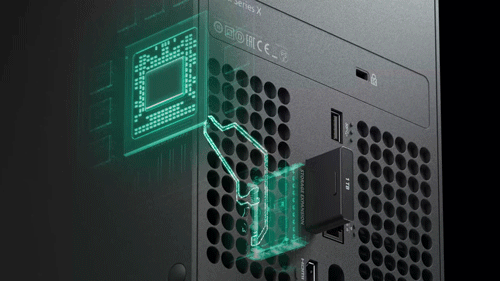

# Actividad 6
## Reflexión sobre la Actividad  

Aprendí cómo las computadoras representan y almacenan datos, y cómo cada tipo de dato ocupa un espacio específico en memoria. También entendí la importancia de optimizar el almacenamiento, ya que el uso de memoria puede aumentar rápidamente según la cantidad de datos.

Esta actividad me mostró la relevancia de elegir correctamente los tipos de datos para mejorar la eficiencia y el rendimiento de los programas.  

imagen de: https://images.app.goo.gl/iAZFFBJita8Uimvs8