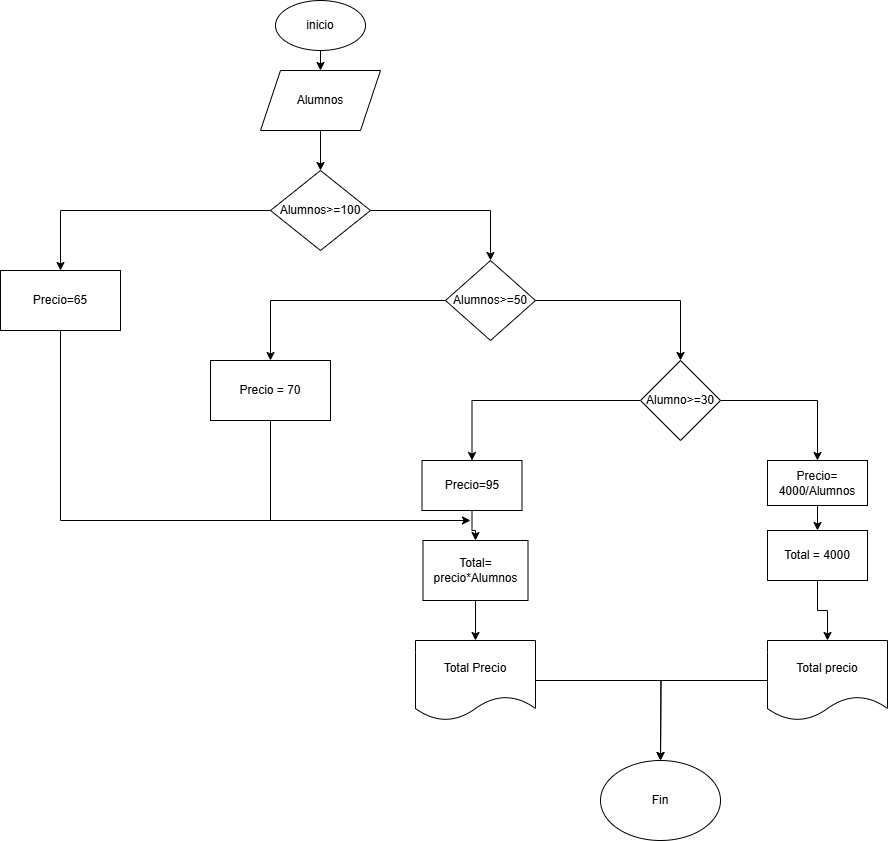

# Ejercicios de Algoritmos  

## Ejercicio 1  
  
Figura 1. Lápiz

Realice un algoritmo para determinar cuánto se debe pagar por equis cantidad de lápices considerando que si son 1000 o más el costo es de $85 cada uno; de lo contrario, el precio es de $90. Represéntelo con el pseudocódigo y el diagrama de flujo. 

**Pseudocódigo:**  
Inicio
  1. Leer Cantidad_Lapices
  2. Si Cantidad_Lapices >= 1000 Entonces
       Precio_Unitario = 85
     Sino
       Precio_Unitario = 90
     FinSi
  3. Calcular Total_Pago = Cantidad_Lapices * Precio_Unitario
  4. Imprimir "Total a pagar: ", Total_Pago
Fin


## Ejercicio 2  


Un almacén de ropa tiene una promoción: por compras superiores a $250 000 se les aplicará un descuento de 15%, de caso contrario, sólo se aplicará un 8% de descuento. Realice un algoritmo para determinar el precio final que debe pagar una persona por comprar en dicho almacén y de cuánto es el descuento que obtendrá. Represéntelo mediante el pseudocódigo y el diagrama de flujo. 

**Pseudocódigo:**
```
Inicio
  1. Leer Precio_Compra
  2. Si Precio_Compra > 250000 Entonces
       Descuento = Precio_Compra * 0.15
     Sino
       Descuento = Precio_Compra * 0.08
     FinSi
  3. Calcular Precio_Final = Precio_Compra - Descuento
  4. Imprimir "Precio final a pagar: ", Precio_Final
  5. Imprimir "Descuento aplicado: ", Descuento
Fin
```
## Ejercicio 3 
 .png)

El director de una escuela está organizando un viaje de estudios, y requiere determinar cuánto debe cobrar a cada alumno y cuánto debe pagar a la compañía de viajes por el servicio. La forma de cobrar es la siguiente:  
- Si son **100 alumnos o más**, el costo por cada alumno es de **$65.00**.  
- De **50 a 99 alumnos**, el costo es de **$70.00**.  
- De **30 a 49 alumnos**, el costo es de **$95.00**.  
- Si son **menos de 30 alumnos**, el costo de la renta del autobús es de **$4000.00**, sin importar el número de alumnos.  

**Pseudocódigo:**
```
Inicio
  1. Leer Cantidad_Alumnos
  2. Si Cantidad_Alumnos >= 100 Entonces
       Costo_Alumno = 65
       Total_Pago = Cantidad_Alumnos * Costo_Alumno
     Sino Si Cantidad_Alumnos >= 50 Entonces
       Costo_Alumno = 70
       Total_Pago = Cantidad_Alumnos * Costo_Alumno
     Sino Si Cantidad_Alumnos >= 30 Entonces
       Costo_Alumno = 95
       Total_Pago = Cantidad_Alumnos * Costo_Alumno
     Sino
       Total_Pago = 4000
       Costo_Alumno = Total_Pago / Cantidad_Alumnos
     FinSi
  3. Imprimir "Total a pagar a la compañía: ", Total_Pago
  4. Imprimir "Costo por alumno: ", Costo_Alumno
Fin
```


