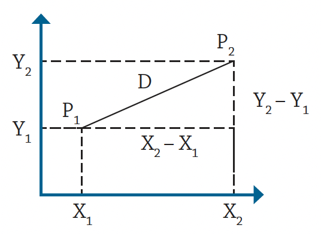
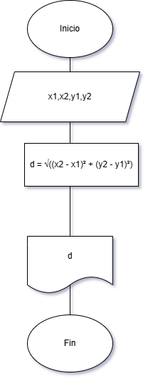

# Problema 1 



Imagen1. Diagrama en el plano cartesiano.

Se requiere obtener la distancia entre dos puntos en el plano cartesiano,
tal y como se muestra en la figura 1. Realice un diagrama de flujo y pseudocódigo
que representen el algoritmo para obtener la distancia entre
esos puntos.

## 📝 Pseudocódigo
```
Inicio
    Escribir "(x1, y1):"
    Leer x1, y1
    Escribir "(x2, y2):"
    Leer x2, y2
    d = √((x2 - x1)² + (y2 - y1)²)
    Escribir d
Fin
```
## Diagrama de flujo 

