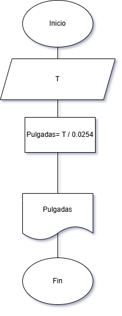

# Problema 2

Imagen2 [Modista](https://static.vecteezy.com/system/resources/previews/013/224/760/original/making-handmade-cloths-vector.jpg)

Una modista, para realizar sus prendas de vestir, encarga las telas al extranjero.
Para cada pedido, tiene que proporcionar las medidas de la tela
en pulgadas, pero ella generalmente las tiene en metros. Realice un algoritmo
para ayudar a resolver el problema, determinando cuántas pulgadas
debe pedir con base en los metros que requiere. Represéntelo mediante un
diagrama de flujo y pseudocódigo (1 pulgada = 0.0254 m).

## 📝 Pseudocódigo
```
Inicio
    Escribir "T:"
    Leer T
    pulgadas= T / 0.0254
    Escribir pulgadas
Fin
```

