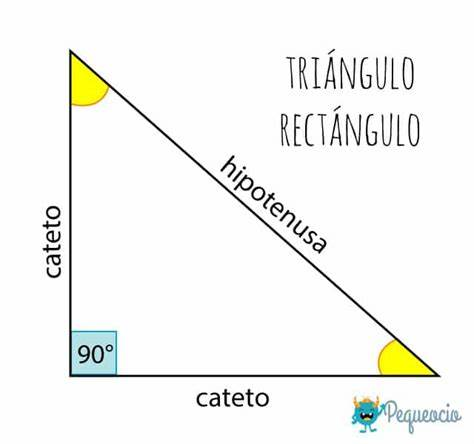
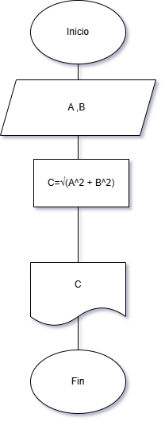

# Problema 3 


Imagen [Triangulo rectangulo](https://www.pequeocio.com/wp-content/uploads/2019/07/triangulo-rectangulo.jpg) 

Se requiere determinar la hipotenusa de un triángulo rectángulo. ¿Cómo sería el diagrama de flujo y el pseudocódigo que representen el algoritmo para obtenerla? 
Recuerde que por Pitágoras se tiene que: $C^2 = A^2 + B^2$.

## 📝 Pseudocódigo
```
Inicio
    Escribir "A,B"
    Leer A,B
    C=√(A^2 + B^2)
    Escribir C
Fin
```

